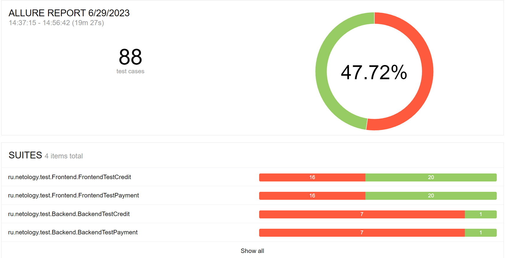

# Отчёт по итогам тестирования
Отчёт по результату автоматизированного тестированию функционала покупки и оформления кредита по данным карты веб-сервиса покупки тура
"Путешествие дня".

### Количество тест-кейсов
Всего было проведено 53 автотеста. Общий процент успешных тестов равен 45.28%.

Результаты прогонов тестов не зависят от подключённой БД.

### Результаты тестов по градации серьезности:

### Результаты тестов по тестируемому функционалу:

### Общие итоги:

|                  | Кол-во тестов | Passed | Failed | Passed, % |
|:-----------------|:-------------:|:------:|:------:|----------:|
| API тестирование |      16       |   4    |   12   |       25% |
| UI тестирование  |      37       |   20   |   17   |    54.05% |
| Всего            |      53       |   24   |   29   |    45.28% |

В результате прогона тестов было составлено 14 [баг-репортов](https://github.com/GOODRUS/diplom2023/issues). 

## Общие рекомендации

- для увеличения testability SUT рекомендуется добавить элементам страницы атрибут test-id
- необходимо качественная техническая документация по проекту
